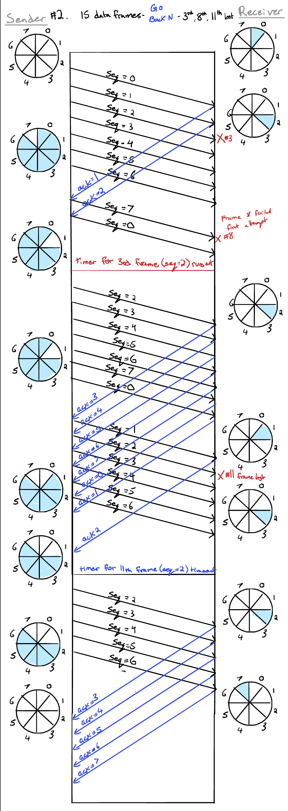
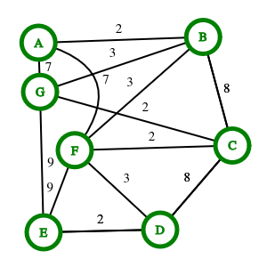
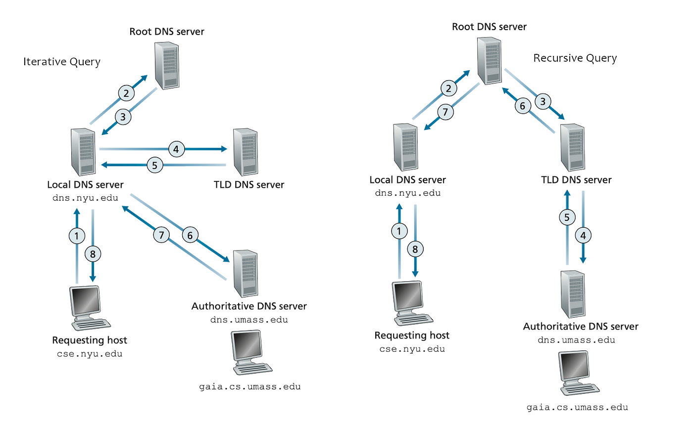

# CSCI 460 Final Exam Study Guide

## Table of Contents

1. [Data Link Layer](#data-link-layer)  
   - [Data Link Layer Protocols for Flow Control](#data-link-layer-protocols-for-flow-control)  
     - [Stop and Wait Protocol](#stop-and-wait-protocol)  
     - [Sliding Window Protocol](#sliding-window-protocol)  
     - [Sliding Window Protocol with Go Back N](#sliding-window-protocol-with-go-back-n)  
     - [Sliding Window Protocol with Selective Repeat](#sliding-window-protocol-with-selective-repeat)  
     - [1-bit Sliding Window Protocol](#1-bit-sliding-window-protocol)  
2. [Medium Access Control Sublayer](#medium-access-control-sublayer)  
   - [Channel Allocation Problem](#channel-allocation-problem)  
   - [Multiple Access Protocols](#multiple-access-protocols)  
     - [Pure ALOHA](#pure-aloha)
     - [Slotted ALOHA](#slotted-aloha)  
     - [Carrier Sense Multiple Access (CSMA)](#carrier-sense-multiple-access-csma)  
     - [CSMA with Collision Detection (CSMACD)](#csma-with-collision-detection-csmacd)  
     - [Binary Exponential Backoff Algorithm in CSMA/CD](#binary-exponential-backoff-algorithm-in-csmacd)  
   - [Classic Ethernet](#classic-ethernet)  
   - [Switched and Gigabit Ethernet](#switched-and-gigabit-ethernet)  
3. [Network Layer](#network-layer)  
   - [Store and Forward Packet Switching](#store-and-forward-packet-switching)  
   - [Datagrams](#datagrams)  
   - [Routers](#routers)  
   - [Routing Algorithms](#routing-algorithms)  
     - [Distance Vector Routing](#distance-vector-routing)  
     - [Shortest Path Computation](#shortest-path-computation)  
     - [Link State Routing](#link-state-routing)  
   - [Internet Protocol (IP)](#internet-protocol-ip)  
     - [IP Header](#ip-header)  
     - [Classful and CIDR IP Addresses](#classful-and-cidr-ip-addresses)  
     - [Sub-netting, ISP Assignment, Aggregation, and Longest Prefix Matching](#sub-netting-isp-assignment-aggregation-and-longest-prefix-matching)  
     - [Network Address Translation (NAT)](#network-address-translation-nat)  
     - [Address Resolution Protocol (ARP)](#address-resolution-protocol-arp)  
     - [Dynamic Host Configuration Protocol (DHCP)](#dynamic-host-configuration-protocol-dhcp)  
     - [Internet Control Message Protocol (ICMP)](#internet-control-message-protocol-icmp)  
4. [Transport Layer](#transport-layer)  
   - [User Datagram Protocol (UDP)](#user-datagram-protocol-udp)  
   - [Transport Control Protocol (TCP)](#transport-control-protocol-tcp)  
     - [TCP Segment Header](#tcp-segment-header)  
     - [TCP Connection](#tcp-connection)  
     - [TCP Flow Control](#tcp-flow-control)  
     - [TCP Congestion Control](#tcp-congestion-control)  
     - [TCP Retransmission Timer](#tcp-retransmission-timer)  
5. [Application Layer](#application-layer)  
   - [DNS](#dns)  
   - [HTTP](#http)  
   - [FTP](#ftp)  
6. [POSIX system calls and the library functions covered in Project2](#posix-system-calls-and-the-library-functions-covered-in-project2)  
7. [Answers to Sample Questions](#sample-questions)
---

## Data Link Layer

### Data Link Layer Protocols for Flow Control

#### Stop and Wait Protocol

Rules for sender:
- Send one packet at a time.
- Send next packet only after receiving ACK for previous.

Rule for receiver:
- Receive and consume 1 packet then send ACK.

With ARQ:
- Sequence numbers attached to packets.
- If ACK not received after some timer goes off on sender side,
sender resends the frame.

#### 1-bit Sliding Window Protocol

```c
void protocol4(void) {
    seq_nr next_frame_to_send;   /* 0 or 1 only */
    seq_nr frame_expected;       /* 0 or 1 only */
    frame r, s;                  /* scratch variables */
    packet buffer;              /* current packet being sent */
    event_type event;

    next_frame_to_send = 0;     /* next frame on the outbound stream */
    frame_expected = 0;         /* frame expected next */

    from_network_layer(&buffer);   /* fetch a packet from the network layer */
    s.info = buffer;               /* prepare to send the initial frame */
    s.seq = next_frame_to_send;    /* insert sequence number into frame */
    s.ack = 1 < frame_expected;    /* piggybacked ack */
    to_physical_layer(&s);         /* transmit the frame */
    start_timer(s.seq);            /* start the timer running */

    while (true) {
        wait_for_event(&event);    /* frame arrival, cksum err, or timeout */

        if (event == frame_arrival) {
            from_physical_layer(&r);   /* go get it */

            if (r.seq == frame_expected) {
                to_network_layer(&r.info);   /* pass packet to network layer */
                inc(frame_expected);         /* invert seq number expected next */
            }

            if (r.ack == next_frame_to_send) {
                stop_timer(r.ack);           /* turn the timer off */
                from_network_layer(&buffer); /* fetch new pkt from network layer */
                inc(next_frame_to_send);     /* invert sender’s sequence number */
            }
        }

        s.info = buffer;               /* construct outbound frame */
        s.seq = next_frame_to_send;   /* insert sequence number into it */
        s.ack = 1 < frame_expected;   /* seq number of last received frame */
        to_physical_layer(&s);        /* transmit a frame */
        start_timer(s.seq);           /* start the timer running */
    }
}

```

#### Sliding Window Protocol

- Window is advanced every time ACK is received.

#### Sliding Window Protocol with Go Back N

- Sender window size is equal to $2^N - 1$. 
- Receiver window is always 1 frame.
- If ACK is not received, time out, and then retransmit the N frames in
the window.

#### Sliding Window Protocol with Selective Repeat

- Sender and receiver window sizes are both equal to $2^N - 1$. 

---

## Medium Access Control Sublayer

### Channel Allocation Problem

- The **channel allocation problem** is, how do we allocate
a single broadcast channel between different users?
- The channel might be the electromagnetic spectrum in a
certain region, or an optical fibre connection.
- It is also called the **multiple access problem**, and
attempts to rectify it, **multiple access protocols**.
- The ideal Multiple Access Protocol would have the following
characteristics.
  - If there is only one sender, they would get the entire
  bandwidth, wasting none.
  - If there are many senders, they would get equal access to
  the bandwidth, privileging or throttling none.
  - It should be simple, and cheap to implement.
- Multiple access protocols fall into one of three families.
- The first is **channel partitioning**.
  - Time Division Multiplexing divides the passage of time into
  time frames within which there are time slots for individual
  nodes to broadcast during.
  - The limiting factor in TDM is *rate*.
  - Frequency Division Multiplexing divides the EM spectrum,
  like how FM radio stations are laid out.
  - The limiting factor in FDM is *bandwidth*.
- The second is **random access**.
  - Pure ALOHA.
  - Slotted ALOHA has $L$ bit-time frames.
  - Slots are $L/R$ s.
  - Nodes can send at the start of a slot.
  - Nodes are synchronized so they all know when
  slots and frames are.
  - All nodes can detect a collision.
- The third is **taking turns**.
  - In the polling protocol, the master node polls each node
  round-robin to tell it to send some number of frames.
  - A downside is that there is delay that comes with polling.
  - Benefits are that there are no empty slots or collisions.
  - In the token passing protocol, there is no master node,
  and a special token frame is exchanged between nodes in some
  fixed order.
  - When a node gets the token, it forwards it if it has no
  frames to send. If it has frames to send, it sends them,
  up to some maximum, then forwards the token.

### Multiple Access Protocols

#### Pure ALOHA
- In Pure ALOHA, nodes transmit whenever they have data to send.
- After each node sends its frame to the central computer, the
central compute rebroadcasts the frame to all of the stations.
- A sending node listens to the "echo" to see if its frame got
through.
- If the frame was destroyed, the sender waits a random time and
sends it again.
- The waiting time is random so that the same frames do not 
collide over and over.
- Throughput is maximized if frames are the same size.
- There is tremendous potential for collisions in Pure ALOHA.
- If the first bit of a new frame overlaps with the last bit of a
frame before it, both frames will be destroyed.

#### Slotted ALOHA
- Slotted ALOHA divides time into discrete **slots**, which are
each the length it takes to transmit one frame.
- The slot boundaries can be synchronized by having a special
station transmit a heartbeat at the start of each interval,
acting as a clock.
- A station is not permitted to send at any time. It is required
to wait for the beginning of the next slot.
- The period of vulnerability for frames is halved.
- At best, slotted ALOHA has a 37% success rate.
- 37% of slots are empty and 26% are collisions.


#### Carrier Sense Multiple Access (CSMA)
- 1-Persistent CSMA works as follows.
  - When a node has data to send, it listens to the channel to
  see if anyone else is transmitting.
  - If the channel is free, the node sends its frame.
  - If the channel is busy, the node waits until it is free.
  - Then it sends its frame.
  - If there is a collision, the node waits a random time
  and starts over.
  - This is called 1-persistent because, when the node finds
  the channel empty, it has a probability of 1 that it will send.
- Non-persistent CSMA works as follows.
  - A node senses the channel when it wants to send a frame.
  - If the channel is free, the node sends its frame.
  - If the channel is busy, the node waits a random time and
  starts over.
  - Fewer collisions, better utilization, and longer delays 
  than 1-persistent CSMA.
- P-persistent CSMA
  - A node senses the channel when it wants to send a frame.
  - If it is idle, then there is probability $p$ that it transmits.
  - There is probability $q = 1 - p$ that it defers to next slot.
  - This process repeats until either the frame is transmitted,
  or another node begins transmitting.
  - In the event another node began transmitting, the node waits
  a random time and starts again.
- Propagation delay affects collision rate.
- If one node has just started sending, another station may
sense the channel and not yet have realized the first node is
sending.


#### CSMA with Collision Detection (CSMA/CD)
- In a CSMA/CD protocol, the nodes can detect when a collision
is happening and stop transmitting since the frame is a lost cause.
- The detection is an analog process. The node's hardware
reads the signal, and if it differs from what it is sending out
a collision is occuring.
- The Ethernet MAC protocol includes the following in addition
to basic CSMA/CD.
- If the node detects collision, it stops transmitting
immediately, *and* sends the 48 bit jam signal.
- After sending the jam signal, the node enters 
**exponential backoff**. 

#### Binary Exponential Backoff Algorithm in CSMA/CD
- After the $n$ th collision, the node chooses a random $K$
from $\{ 1, 2, \cdots, 2^{m - 1} \}$ where $m=\min(n, 10)$.
- The node waits $512K$ bit times and then attempts transmission.
- For example, If the rate is 10mbps, a bit is transmitted 
every microsecond.

### Classic Ethernet

### Switched and Gigabit Ethernet

---

## Network Layer

### Store and Forward Packet Switching

### Datagrams

### Routers

### Routing Algorithms

#### Distance Vector Routing

#### Shortest Path Computation

#### Link State Routing

- Centralized
- Topography known to all nodes
- Link state packets have the following format

```
|    A    |
|---------|
| Seq Num |
|   Age   |
|---------|
| B |  3  |
| C |  2  |
| D |  9  |
```
### Internet Protocol (IP)

#### IP Header

#### Classful and CIDR IP Addresses

#### Sub-netting, ISP Assignment, Aggregation, and Longest Prefix Matching

#### Network Address Translation (NAT)

#### Address Resolution Protocol (ARP)

The Address Resolution protocol resolves IP addresses to MAC addresses
also known as LAN addresses, a layer 2 means of identifying hosts.

Devices keep a table that maps IP addresses to MAC addresses. This is the
ARP table or ARP cache.

The following primitives/features are used.
ARP request: a broadcast message seeking any host that can resolve some
IP into a MAC.
ARP reply: a unicast message sending the desired MAC address back to a 
requesting host.
Gratuitous ARP: A host that has just joined the network makes a request
for the MAC of its own IP address to proactively update other hosts' 
ARP caches.
Proxy ARP: The router stands in place of every other host (on other
subnets, elsewhere on the internetwork, etc.). When a host requests
an outside address, the router returns its own MAC address so that
it can act as a proxy.

#### Dynamic Host Configuration Protocol (DHCP)

#### Internet Control Message Protocol (ICMP)

---

## Transport Layer

### User Datagram Protocol (UDP)

- best-effort datagram protocol
- no SEQ or ACK
- no flow or congestion control

### Transport Control Protocol (TCP)

- Connection-oriented
- Point to point, reliable, in-order *byte stream*

#### TCP Segment Header

- Source port
- Destination port
- Sequence number: Byte stream number of first byte in segment's data
- Acknowledgement number: Sequence number of next byte expected from other side. 
  - Cumulative ACK for all students
- Header length
- Flags
- Receive window
- Internet checksum
- Urgent data pointer
- Options
- Application data

#### TCP Connection

#### TCP Flow Control

#### TCP Congestion Control

#### TCP Retransmission Timer

---

## Application Layer

### DNS

- DHCPDISCOVER: Broadcast, host is looking for a DHCP server.
- DHCPOFFER: Unicast, server offers an IP to the requesting host.
- DHCPREQUEST: Unicast, host accepts IP.
- DHCPACK: Unicast, server acknowledges, concluding transaction.

### HTTP

- HTTP methods: GET, POST, PUT, DELETE, OPTIONS, etc.
- Access/serve resources

### FTP

- Client connection and data connection

---

## POSIX system calls and the library functions covered in Project2

---

## Sample Questions

## 1. If 8-bit sequence number field is being used in a sliding window protocol with Go back N, what
is the maximum possible sequence number and why? What is the maximum possible window
size at the sender and why? What is the maximum possible window size at the receiver and
why? 15 points

maximum possible sequence number is 255 because that is the largest number we can store
in 8 bits: 1111 1111

The sender window needs to be one frame smaller than the receiving window in the Go
Back N Sliding Window protocol. This prevents the following.
- Senders sends 256 frames.
- Receiver receives and acknowledges all. All ACKs are lost!
- Sender times out on 256 frames and resends them.
- Receiver interprets these as 256 new frames. The protocol has failed.

The receiver window is always 1 frame in Go Back N. Out of order frames are not accepted.
The receiver discards all subsequent frames. Since they receive no ack in return they 
will be resent.

## 2. Assume a data link layer sender sends 15 data frames with Go back N sliding window protocol



## 3. Assume sliding window protocol with Go back N and 4-bit sequence number are being used and
the current sender and receiver windows (highlighted) are as below. How many frames have
already been sent at the least? How many acknowledgements have been received at the least?
How many acknowledgements are pending? Will receiver acknowledge a frame if it arrives with
a sequence number 1? Give the rationale of your answers. 15 points

From the sender window:
- All sequence numbers but 5 can be sent.
- At the beginning, the out of range sequence number would have been 15.
- So the window must have been advanced 6 times $\equiv$ 6 ACKs received.
- This advance happens when ACK is received. So ACK must have been
received for frames with SEQ numbers 0, 1, 2, 3, 4, 5.
- How many ACKs are pending?

From the receiver window:
- Expecting sequence number 6 only. That means sequence numbers [0,  5]
have been received. At least 6 frames have been received.
- Sequence number 1 is not in the receiver window, so it would not be accepted.

## 4. Explain how p-persistent CSMA/CD multiple access protocol works. 15 points

- When an adapter has a frame to send, it first senses the channel.
- If the channel is free, it has a $p$ probability of sending and a $q=1-p$ probability of
deferring to the next slot.
- The process repeats until either the frame is sent or there is a collision.
- If there is a collision, the adapter waits a random time and starts the process again.

## 5. Explain how Token Ring multiple access protocol works. 15 points

- Nodes only send frames when they are in posession of a special packet called the 
token, which they send from one node to the next.
- When they receive the token...
  - If they have no frames they immediately forward the token.
  - If they have frames to send, they send them, up to some maximum; then they forward the token.

## 6. What is the purpose of Pad bytes in an Ethernet frame? 10 points

When a payload is less than the minimum length pad bytes are added.
The minimum is 64 bytes.

## 7. If the nodes in a network are connected as shown below, what is the initial distance vector in each node? 25 points


Humayun: Don't list non-adjacent nodes as having infinite distance, 
they aren't known of at all by the host, so just omit them

Template:


| Node | Distance |
|------|----------|
| A    | --       | 
| B    | --       | 
| D    | --       | 
| E    | --       | 
| F    | --       | 
| H    | --       | 
| I    | --       |

A:

| Node | Distance |
|------|----------|
| B    | 9        | 
| D    | 2        | 
| E    | 4        | 

B:

| Node | Distance |
|------|----------|
| A    | 9        | 
| E    | 5        | 
| F    | 6        | 

D:

| Node | Distance |
|------|----------|
| A    | 2        | 
| E    | 6        | 
| H    | 3        | 

E:

| Node | Distance |
|------|----------|
| A    | 4        | 
| B    | 5        | 
| D    | 6        | 
| F    | 13       | 
| H    | 5        | 
| I    | 4        | 

F:

| Node | Distance |
|------|----------|
| B    | 6        | 
| E    | 13       | 
| I    | 7        | 

H:

| Node | Distance |
|------|----------|
| D    | 3        | 
| E    | 5        | 
| I    | 9        | 

I:

| Node | Distance |
|------|----------|
| H    | 9        | 
| E    | 4        | 
| F    | 7        | 

## 8. If the nodes in a network are connected as shown below, what will be link state packet contents in each node?

Doing just 1 node to show the algorithm but save time.

### Node A

| Node | Distance & Path |
|------|-----------------|
| B    | 9 AB     | 
| D    | 2 AD     | 
| E    | 4 AE     | 
| F    | 15 ABF   | 
| H    | 5  ADH   | 
| I    | 8  AEI   |

## 9. If a network has following link state packets flooded among its nodes, what is the graph model
of the network and what will be the routing table entries at node C? Show how you have
computed the routing table entries. 25 points



Routing table at C:

| Destination | Next Hop |
|-------------|----------|
| A | F
| B | F
| D | F
| E | D
| F | F 
| G | F

## 10. If your network address is 104.142.0.0/16 and you have 4 departments A, B, C, and D.
The number of hosts in these departments are given in the table below. Create one subnet for each
department minimizing the wastage of host addresses in your network. What will be the subnet
addresses of these departments in your network? Show how you have computed the subnet
addresses. 15 points

### Subdivision 1: Department D needs 800 hosts.

Start with `104.142.0.0/16`.

This has the mask `FF.FF.0.0`.

The current network portion length is 16. To accomodate 800 hosts, the closest power of 2 is 1024
which is $2^{10}$. 

So we need 10 bits to be in the host portion. So our new length will be 22.

Network address: `104.142.0.0/22`

Mask: `FF.FF.1111  1100 . 0000  0000`

Range: `104.142.0.0/22 to 104.142.3.255/22`

Next available address will be `104.142.4.0`

### Subdivision 2: Department C needs 400 hosts.

Start with `104.142.4.0/16`.

400 hosts is about half so we will need about half as much length for hosts. 
Network portion length of 23 would allow 2^9 or 512 hosts.

Network address: `104.142.4.0/23`

Mask: `FF.FF.1111  1110 . 0000  0000`

Range: `104.142.4.0/23 to 104.142.5.255/23`

Next available address will be `104.142.6.0`

### Subdivision 3: Department B needs 200 hosts.

Network portion length of 24 would allow for 2^8 or 255 hosts.

Mask: `FF.FF.FF.0`

Range: `104.142.6.0/24 to 104.142.6.255/24`

Next available address will be `104.142.7.0`

### Subdivision 4: Department A needs 100 hosts.

Network portion length of 25 would allow for 2^7 or 128 hosts.

Mask: `FF.FF.FF.1000 0000`

Range: `104.142.7.0/25 to 104.142.7.127/25`.

Subdivision complete.

## 11. If an IP router has following IP addresses in its routing table entries, what IP addresses will it
advertise? Show how you have computed the aggregated IP address. 10 points

## 12. Assume a NAT box with public IP address 140.234.20.239 receives IP packets with following
source and destination IPs and ports from the private hosts of its private network when its NAT
table is empty. Assume the IP packets have arrived in the order shown in the table below. What
will be the translated source and destination IPs and ports for these IP packets in order to send
them through the Internet? What will be NAT table entries after translating all the above IP
packets? 15 points

## Give 2 examples of ICMP message usages. 10 points

- Ping
- Address not reachable

## 13. Explain how ARP and Proxy ARP works. 15 points

The Address Resolution protocol resolves IP addresses to MAC addresses
also known as LAN addresses, a layer 2 means of identifying hosts.

Devices keep a table that maps IP addresses to MAC addresses. This is the
ARP table or ARP cache.

The following primitives/features are used.
ARP request: a broadcast message seeking any host that can resolve some
IP into a MAC.
ARP reply: a unicast message sending the desired MAC address back to a 
requesting host.
Gratuitous ARP: A host that has just joined the network makes a request
for the MAC of its own IP address to proactively update other hosts' 
ARP caches.
Proxy ARP: The router stands in place of every other host (on other
subnets, elsewhere on the internetwork, etc.). When a host requests
an outside address, the router returns its own MAC address so that
it can act as a proxy.
## 14. Explain how DHCP protocol works. 10 points

- DHCPDISCOVER: Client looks for DHCP server
- DHCPOFFER: Server offers IP address
- DHCPREQUEST: Client accepts IP address
- DHCPACK: Server confirms lease, transaction complete

## 15. If a TCP sender’s current congestion window is 16KB, 
and its current slow-start-threshold is 64KB and there is no segment loss, 
what will be its congestion window after 12 th RTT from now and why? 10 points

The TCP sender will double its CWND until reaching the threshold. For the
remaining RTTs it will increase CWND size by one MSS (additive increase).

```
0: 16
1: 32
2: 64 (hit threshold - enter CA/AIMD phase)
3: 64 + 1 MSS
  .
  .
  .
11: 64 + 9 MSS
```

## 16. How do you compute UDP checksum? 10 points

- Treat the UDP segment as a sequence of 16 bit integers, or equivalently, 4 hex digits.
- Sum them normally and if there is any carry, eg. a 17th bit due to carries, add it to
the LSB side. This is "wraparound".
- Store this sum in the checksum field.


## 17. A TCP receiver has 6KB buffer and it does not pass the received data to the upper layer until the
buffer is full or the connection is terminating. The TCP sender on the other end has 30KB data to
send and the maximum segment size (MSS) has been negotiated to 4KB, i.e., the sender needs
to send multiple TCP segments to send 30KB data. Show all the data and acknowledgement
segments in sequence that are being sent and received by the sender and the receiver
respectively. Show the successive sequence number and the data size of the data segments.
Show the successive acknowledgement number and the window size of the acknowledgement
segments. 25 points

## 18. What steps a web browser takes to browse a web page from a web server? What steps a web
Steps a client (browser) takes to follow a hyperlink:
- Determine the protocol (HTTP or HTTPS)
- Ask DNS for the IP address of the server
- Make a TCP connection to the server
- Send request for the page; server sends it back
- Fetch other URLs as needed to display the page
- Close idle TCP connections

Steps a server takes to serve pages:

- Resolve name of Web page requested
- Perform access control on the Web page
- Check the cache
- Fetch requested page from disk or run program, if
necassury
- Determine the rest of the response
- Return the response to the client
- Make an entry in the server log

## 20. Give the examples of both recursive and iterative DNS queries, 15 points



## 21. Explain the use of following networking system functions. 20 points
### a. getaddrinfo()

Signature: 
```c
int getaddrinfo(
  char* node, 
  char* service,
  struct addrinfo * hints,
  struct addrinfo ** res);
```

getaddrinfo() converts human-readable text strings representing hostnames or 
IP addresses into a dynamically allocated linked list of struct addrinfo 
structures. The function prototype for this function is specified as follows:

hostname
    can be either a domain name, such as "example.com", an address string, such as "127.0.0.1", or NULL, in which case the address 0.0.0.0 or 127.0.0.1 is assigned depending on the hints flags.
service
    can be a port number passed as string, such as "80", or a service name, e.g. "echo". In the latter case a typical implementation uses getservbyname() to query the file /etc/services to resolve the service to a port number.
hints
    can be either NULL or an addrinfo structure with the type of service requested.
res
    is a pointer that points to a new addrinfo structure with the information requested after successful completion of the function.[3] The function returns 0 upon success and non-zero error value if it fails.

Returns 0 on success, sets `res` to 
one or more addrinfo structures.

### b. bind()

```c
int bind(int fd, struct sockaddr * addr, int addrlen)
```

Binds a socket to a port so it can receive data.

### c. listen()

```c
int listen(int fd, int backlog)
```

Tells the socket to wait for incoming connections and allow
a given number of connections to queue.

### d. accept()

```c
int accept(int fd, struct sockaddr * addr, socklen_t * len)
```

Accepts a connection on given FD. 

Returns new FD.
Fills in `addr` with peer address. The `len` should point to length
of `addr` at call, and will be filled with actual length of address
at return.